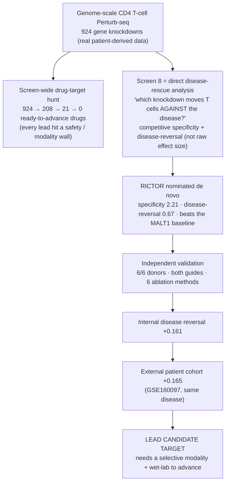

# PerturbGate

**Evidence-Gated Pipeline for T-cell Perturb-seq Mechanism Hypotheses**

A reproducible analysis of a genome-scale primary human CD4 T-cell Perturb-seq
screen, designed to distinguish real perturbation effects from defensible
mechanism hypotheses.

**RICTOR is our lead candidate drug target.** It was nominated *de novo* by our
disease-rescue analysis of the screen, survived the internal evidence gates, and
reproduced the same directional reversal in an **external JIA patient cohort**. It is
a promising, evidence-backed target **hypothesis** — the step from here to an
advanceable drug is a RICTOR-selective molecule plus experimental validation. Our
first lead, **PAK2**, was technically reproducible but **failed the disease-direction
test** and was rejected.

## TL;DR

- **What we built** — an open, reproducible pipeline that turns a genome-scale human
  CD4 T-cell Perturb-seq screen into **auditable drug-target hypotheses**, not just a
  ranked hit list. Every number resolves to a committed artifact.
- **What we found** — **RICTOR**: knocking it down moves inflamed-joint (JIA) CD4
  T cells *against* the disease programme (internal reversal **+0.161**), and this
  **reproduces in an external patient cohort** (**+0.165**, GSE160097; 6/6 paired
  leave-one-donor-out). PAK2 looked good technically but was **rejected** on the
  disease-direction test.
- **Why it matters** — most Perturb-seq studies stop at *"which knockdown changes the
  cell most."* We show *which effects survive the evidence required to nominate a
  target* — and we state, honestly, what is still missing before RICTOR is a drug.

### How we got RICTOR (and what "Screen 8" is)



**"Screen 8" is our direct disease-rescue analysis** — instead of ranking the biggest
perturbations, it asks *which knockdown pushes T cells against the disease programme*
(using competitive specificity and disease-reversal projection). **RICTOR was nominated
there, de novo — it is not a post-hoc pick and did not appear after the screen-wide
"0".** Full evidence-graded provenance:
[docs/RICTOR_ORIGIN_AND_DECISION_PATH.md](docs/RICTOR_ORIGIN_AND_DECISION_PATH.md).

[](https://github.com/MargoSolo/perturbgate-perturbseq/actions/workflows/ci.yml)


-brightgreen)


> **Platforms.** CI is green on `ubuntu-latest` (Python 3.10/3.11/3.12) and
> `macos-latest` (Apple Silicon, Python 3.11) — macOS is **verified on macOS CI**,
> not claimed by inspection alone (install, tests, demo, reproduce, verify, audit
> and a byte-stability check all pass). See
> [docs/MACOS_QUICKSTART.md](docs/MACOS_QUICKSTART.md).

---

## Judge quickstart

*Built with Claude: Life Sciences — Research track. Everything below runs on a
laptop with no private data.*

1. **Watch the 3-minute demo** — shot list + voiceover in
   [docs/DEMO_SCRIPT.md](docs/DEMO_SCRIPT.md) *(video to be recorded from this
   script; see [Video assets](#video-assets)).*
2. **Open PerturbGate Explorer** — [reports/perturbgate_explorer.html](reports/perturbgate_explorer.html)
   (self-contained; search all 924 perturbations by gene and read why each was or
   was not advanced).
3. **Review the main result table** — [the finding table below](#2-main-finding)
   / [`results/frozen/primary_comparison.tsv`](results/frozen/primary_comparison.tsv).
4. **Run `make demo`** — recomputes RICTOR's **+0.161** disease reversal from
   compact committed inputs in under two minutes and validates the golden values.
5. **Run `make external-gse160097`** — recomputes the **external** RICTOR reversal
   **+0.165** on an external paired JIA cohort (GSE160097) and validates it
   ([External same-disease concordance](#external-same-disease-concordance)).
6. **Inspect the complete decision trail** —
   [docs/DECISION_TRAIL.md](docs/DECISION_TRAIL.md) and the
   [rejection ledger](results/frozen/rejection_ledger.tsv).

---

## 1. Biological question

**Which perturbation hits in a genome-scale primary human CD4 T-cell Perturb-seq
screen remain credible after responder, guide, donor, disease-direction,
null-calibration, confound, safety and modality checks?**

Perturb-seq can identify thousands of real cellular effects. The open question for
target discovery is not *which knockdown changes the cell most*, but *which
effect survives the additional evidence required to nominate a mechanism or a
target*. We analysed **924 gene-target perturbations** (the perturbations with a
usable genome-scale effect vector; every row is a unique gene knockdown — see the
[denominator audit](results/frozen/denominator_audit.tsv)) against a donor-paired
disease-state direction built from an independent juvenile idiopathic arthritis
(JIA) synovial single-cell atlas.

## 2. Main finding

**How the candidates were found — two stages** (so it is clear *what came from where*):

1. **Nomination — direct disease-rescue analysis** (the "Screen 8" competitive gene-set
   specificity + hard identity/toxicity/donor/direction filters + disease-reversal
   projection, over the same 924-perturbation substrate). **PAK2 and RICTOR were
   nominated *de novo*** (`prior_class = none` — not from literature or an effect-blind
   prior, not manual), each **beating the MALT1 specificity fallback**. **RIPK1** entered
   only as a known, clinically-druggable **comparator/anchor**.
2. **Deep evaluation** of those nominations on the corrected raw-count JIA disease vector
   (guide / donor / condition / confound / matched-null), then **external same-disease
   concordance** (GSE160097) and a **translational red-team**.

| Candidate | Origin / role | Nomination evidence (Screen 8) | Deep-evaluation reversal | Decision |
|---|---|---|---|---|
| **RICTOR** | **de novo nomination** | spec_t **2.21**; disease-reversal **0.673** (broadest, > MALT1); 6/6 donors, both guides, 6/6 ablations | **+0.161** internal · **+0.165** external; both guides +; **11/11** disease-donor LODO +; all 3 conditions +; matched pct 96.5 | **LEAD CANDIDATE TARGET** — evidence-backed hypothesis (needs selective modality + wet-lab) |
| **PAK2** | **de novo nomination** | spec_t **4.75** (most specific node) | +0.010 (not directional; external JIA enrichment activation-confounded) | **REJECTED** (real cellular hit, not therapeutic) |
| **RIPK1** | comparator / known anchor | `prior_class = canonical_activator` (not a de novo nomination) | +0.038 (incoherent) | **COMPARATOR ONLY** |
| **MALT1** | specificity fallback | spec_t **1.39** (broad / non-specific) | — (triangulation baseline) | **Fallback** — beaten on specificity by PAK2 & RICTOR |

**Controlled public labels:** RICTOR = `DISEASE_REVERSING_MECHANISM_NODE_WITH_MODALITY_GAP` ·
PAK2 = `REPRODUCIBLE_CELLULAR_HIT_NOT_THERAPEUTICALLY_DIRECTIONAL` ·
RIPK1 = `COMPARATOR_NOT_DIRECTIONALLY_SUPPORTED_IN_THIS_ANALYSIS`.

> **Reversal is an effect size** (−centered Pearson over shared genes), not a p-value; the two
> Screen-8 columns (specificity-t, disease-reversal projection) and the deep-eval reversal are
> **different metrics** on a **consistent biological direction** (KD suppresses the pathogenic
> programme), *not* directly comparable numbers. Any gene-wise correlation p-values elsewhere are
> **descriptive, not donor-level inference**. Full values:
> [`primary_comparison.tsv`](results/frozen/primary_comparison.tsv) ·
> [`results/rictor_provenance/`](results/rictor_provenance/).

**So RICTOR is not a post-hoc pick** and did **not** appear after the screen-wide "0 advanceable
targets": it was a de novo Screen-8 nomination, independently recomputed (6/6 donors @ Stim48hr,
min comp-t 1.59; both guides; six ablations), and only *then* carried into the +0.161 / +0.165
reversal and translational stop. Evidence-graded provenance:
[RICTOR_ORIGIN_AND_DECISION_PATH.md](docs/RICTOR_ORIGIN_AND_DECISION_PATH.md).

RICTOR's matched-null evidence is **nominal but statistically marginal**: only 200
matched controls exist, 7 of which exceed RICTOR (empirical p ≈ 0.040; finite-pool
95% CI extends to ≈ 0.07). We therefore report *seven strong convergence checks
plus a borderline matched null* — never "8/8 decisive criteria".

**Novelty boundary.** We do **not** claim that RICTOR/mTORC2 regulation of T-cell
differentiation, Tfh, Treg, or autoimmunity is novel. The narrow claim is: *RICTOR-
specific perturbation in primary human CD4 T cells directionally reverses a
donor-paired inflamed-joint activated-memory transcriptional programme involving
tissue-retention and cytotoxic-effector genes, without detectable collapse of the
Treg-identity score in this dataset.* This is a **computational mechanism
hypothesis, not functional validation.**

## External same-disease concordance

We tested the frozen RICTOR-knockdown vector in GSE160097, a public paired
synovial-fluid and peripheral-blood memory-T-cell dataset from patients with
JIA.

The primary analysis used FACS-sorted conventional memory CD4 T cells and raw
UMI counts, aggregated within donor pairs before constructing the
synovial-fluid-minus-blood disease vector.

Results:

- internal RICTOR reversal: +0.161
- external RICTOR reversal: +0.165
- paired leave-one-donor-out: 6/6 positive
- paired bootstrap median: +0.160
- paired bootstrap 95% interval: +0.113 to +0.191
- PAK2: approximately +0.002
- RIPK1: approximately −0.007

The external signal was diffuse, survived removal of the strongest contributing
genes, and was not explained by the KLF2/SELL/S1PR1/TCF7 egress module.

This supports external same-disease, paired-compartment transcriptional
concordance. It is not an external RICTOR perturbation experiment, therapeutic
validation, or evidence that RICTOR is already an advanceable drug target.

> **Cohort-independence:** `NO_OVERLAP_DETECTED_BUT_NOT_FULLY_VERIFIABLE`. GSE160097
> is *an external public JIA cohort with no detected donor overlap* — reported as
> "external", not "independent", because it shares the Charité/DRFZ Berlin
> institutional ecosystem with the internal atlas and both datasets are
> de-identified. `make external-gse160097` **recomputes from committed donor-pair
> aggregate inputs** (offline, seconds); the **full raw-data reconstruction** uses
> the documented official GEO download route (`--download` mode). Full audit and the
> official-download route in
> [docs/EXTERNAL_CONCORDANCE_GSE160097.md](docs/EXTERNAL_CONCORDANCE_GSE160097.md)
> ([evidence summary](docs/EXTERNAL_EVIDENCE_SUMMARY.md) ·
> [curated artifacts](results/external_validation/gse160097/) ·
> [supplementary figure](figures/supplementary_external_jia_concordance.png)).

## 3. Evidence and the negative result

**Target attrition through evidence gates** — ranking is not validation.
Candidates are retained, downgraded, not advanced, or rejected with an explicit
reason (full trail: [rejection ledger](results/frozen/rejection_ledger.tsv),
[candidate funnel](results/frozen/candidate_funnel.tsv),
[DECISION_TRAIL.md](docs/DECISION_TRAIL.md)).


**RICTOR directionality and matched-null calibration** — we report effect size,
denominator and uncertainty, not a p-value alone. Two RICTOR numbers, never mixed
silently: **+0.161** primary responder-resolved reversal, and **+0.131**
conservative all-cell projection used only to calibrate the matched null.


**Gate matrix** — biological evidence separated from translational readiness. A
row can pass every biological gate yet carry a `TRANSLATIONAL_GAP` in modality
(RICTOR), or pass technical gates and fail directionality (PAK2).


RICTOR now also carries an **external-evidence** gate, which does **not** move the
translational stop:

| Gate | RICTOR |
|---|---|
| **External same-disease concordance** (GSE160097) | **PASS** |
| Selective modality | NONE VALIDATED |
| Human-genetic efficacy | NO SUPPORT |
| Loss constraint | SAFETY HEADWIND |
| Systemic safety | CELL-TYPE CONFLICT |
| Translational readiness | STOP |

**PAK2 rejection case study — the negative result that matters.** PAK2 had strong
on-target knockdown, guide and donor reproducibility, a real responder population,
and a reproducible programme — then failed to restore the disease state, its
external JIA enrichment proved activation-confounded, partial inhibition was not
established, and no safer druggable escape target reproduced the programme.


> **PAK2 passed technical validation but failed therapeutic validation.
> PerturbGate preserves that distinction: it treats a real perturbation effect as
> necessary but not sufficient for target nomination.**

Supplementary figures (linked, not embedded):
[RICTOR robustness](figures/supplementary_rictor_robustness.png) ·
[gate ablation](figures/supplementary_gate_ablation.png). Every figure has source
data under [figures/source_data/](figures/source_data/); legends in
[docs/FIGURE_LEGENDS.md](docs/FIGURE_LEGENDS.md).

## 4. Why it matters

A real perturbation effect can still send a laboratory toward the wrong target.
PerturbGate helps prioritize which experimental validation is worth performing
next: it distinguishes technical perturbation validity, biological
reproducibility, disease directionality, and translational readiness — four
things that a single ranking usually collapses into one.

> **PerturbGate did not succeed because it found a positive hit. It succeeded
> because every retained claim survived an explicit record of how competing
> claims failed.**

Negative results, detected confounds, and superseded interpretations are
first-class, auditable outputs
([SUPERSEDED_RESULTS.md](docs/SUPERSEDED_RESULTS.md),
[FAILURE_MODES.md](docs/FAILURE_MODES.md)).

## 5. Reproducibility

```bash
git clone https://github.com/MargoSolo/perturbgate-perturbseq.git
cd perturbgate-perturbseq

make setup     # install the package (+ dev tools)
make demo      # Level 1: recompute the headline reversal from compact inputs (< 2 min)
make verify    # schemas + golden values + claims + funnel + superseded guard + external + audit
make reproduce # Level 2: recompute robustness from public derived matrices (< 5 min)
make external-gse160097  # external same-disease concordance (GSE160097): +0.165, offline (< 30 s)
make full      # Level 3: reconstruct from open raw data (server-scale)
```

**No `make`?** Every target has a plain-Python equivalent (macOS/Windows/Linux):

| Make target | Plain command |
|---|---|
| `make setup` | `python -m pip install -e ".[dev]"` |
| `make demo` | `python -m perturbgate.cli demo` |
| `make reproduce` | `python -m perturbgate.cli reproduce` |
| `make figures` | `python -m perturbgate.cli figures` |
| `make verify` | `python -m perturbgate.cli verify` |
| `make manifest` | `python -m perturbgate.cli manifest` |
| `make external-gse160097` | `python -m perturbgate.external.gse160097` |
| `make test` | `python -m pytest` |
| `make lint` | `python -m ruff check src scripts tests` |
| `make privacy-audit` | `python scripts/public_readiness_audit.py` |
| `make full` | `python scripts/run_full_pipeline.py` (server-scale) |

macOS users: see [docs/MACOS_QUICKSTART.md](docs/MACOS_QUICKSTART.md) (incl. Apple
Silicon notes and how to serve the Explorer with `python -m http.server`).

| Level | Command | Needs | Time | What it proves |
|---|---|---|---|---|
| **1 Demo** | `make demo` | laptop, committed compact inputs | < 2 min | recomputes RICTOR **+0.161** (and PAK2/RIPK1) from per-gene vectors; regenerates tables + figures; validates golden values |
| **2 Analytical** | `make reproduce` | committed pseudobulk matrices | < 5 min | recomputes guide + disease-donor LODO robustness; compares to frozen |
| **3 Full open-data** | `make full` | open raw data, high-memory server | hours | rebuilds the disease vector + genome-scale effect vectors and reruns everything |

Level 1 is **artifact reproducibility**, not end-to-end raw-data reproduction —
see [REPRODUCIBILITY_LEVELS.md](docs/REPRODUCIBILITY_LEVELS.md). All three public
data resources are open — the **Primary Human CD4+ T Cell Perturb-seq** screen
(Marson/Pritchard; MIT), the **internal JIA disease-reference atlas** (CZ CELLxGENE;
CC-BY-4.0), and **GSE160097** (external JIA memory-CD4 concordance cohort; GEO,
license not explicitly stated) — and only derived per-gene aggregate vectors are
redistributed here (no raw GSE160097 data), with attribution
([Open-data statement](docs/OPEN_DATA_STATEMENT.md) ·
[Data availability](docs/DATA_AVAILABILITY.md) ·
[Data licenses](docs/DATA_LICENSES.md) ·
[manifest](data/public_data_manifest.tsv)).

## 6. Software details

- reusable Python package + CLI (`perturbgate`): disease-reversal scoring,
  matched-perturbation null calibration with finite-pool uncertainty, guide /
  donor / condition / LODO robustness, the pre-specified 8-criterion decision
  gate, candidate attrition, a claim ledger, and code-generated figures;
- frozen public artifacts ([results/frozen/](results/frozen/)) — 924-perturbation
  authoritative reversal table, candidate funnel, rejection ledger, gate matrix,
  gate ablation, matched-null values, claim registry, superseded-claim registry,
  analysis contract, denominator audit, results manifest;
- 69 tests, continuous integration, and an automated privacy / public-readiness
  audit; three reproducibility levels; four main figures + three supplementary.

## Scope and intended use

PerturbGate is not a conventional Perturb-seq hit caller. It asks a stricter
question: which perturbation effects survive the additional evidence required
for mechanism or target nomination?

PerturbGate is designed to:
- distinguish technical perturbation validity from therapeutic directionality;
- expose why candidates were retained, downgraded or rejected;
- produce auditable mechanism hypotheses rather than an opaque score;
- prioritize the next experiments worth performing.

PerturbGate is **not**:
- a clinical or diagnostic tool;
- a medical device;
- a treatment-recommendation system;
- a substitute for experimental validation;
- evidence that RICTOR is already a validated drug target.

> **PerturbGate does not replace wet-lab validation. It helps decide which
> wet-lab experiment is worth running next.**

## What we do **not** claim

> - that RICTOR is a **validated drug target**;
> - that systemic RICTOR inhibition is **safe**;
> - that a **selective RICTOR modality** currently exists;
> - that synovium-vs-blood is equivalent to disease-vs-healthy tissue;
> - that the adjusted-vector sensitivity analysis is **independent biological replication**;
> - that the external GSE160097 concordance is an **independent RICTOR perturbation
>   experiment**, **therapeutic replication**, **causal replication**, or an
>   **independent cohort** (it is external same-disease concordance in a cohort with
>   *no detected donor overlap*, sharing the Charité/DRFZ Berlin ecosystem);
> - that PAK2 is an **anti-inflammatory target**;
> - that **all 924 perturbations** underwent deep candidate validation;
> - that the **nominal matched-null significance** is definitive.

## How Claude was used

**Claude mattered most when the original hypothesis failed.**

Claude Code and Claude Science were used not simply to write code, but to:
- design falsification tests that rejected PAK2;
- detect activation-confounded disease enrichment;
- replace an inflated RICTOR estimate with the corrected **+0.161** result;
- distinguish repeated Monte Carlo draws from 200 independent matched controls;
- preserve negative and superseded results instead of rationalizing them.

In the translational audit, **Claude Science identified and verified two
RICTOR-relevant retraction chains, distinguished vendor-labelled compounds from
validated target engagement, detected neighbour-gene pQTL misattribution, and
preserved a human-genetics efficacy null rather than converting it into support.**

All public claims resolve to data artifacts, primary literature or official
databases, not to AI output. Full detail: [CLAUDE_USAGE.md](docs/CLAUDE_USAGE.md).

## Translational stop signal

Two explicit axes. **Biological evidence:** retained disease-reversing mechanism
hypothesis. **Translational readiness:** stopped —
`NOT_ADVANCEABLE_WITH_CURRENT_EVIDENCE_AND_MODALITIES`.

RICTOR passed the internal disease-reversal gates but did not pass the
translational-readiness gate.

- No validated RICTOR-selective small molecule, degrader, glue, peptide, or
  clinical modality was identified.
- Human genetics provides no efficacy support for lowering RICTOR and indicates
  strong loss-of-function constraint.
- Systemic safety is complicated by opposing immune-cell effects and
  developmental, metabolic, cardiac, and immune liabilities.
- Current evidence supports RICTOR as a mechanism hypothesis, not as an
  advanceable drug target.

> **RICTOR is internally supported as a disease-reversing mechanism hypothesis,
> but it is not currently advanceable as a conventional drug target because no
> validated selective modality exists, human genetics provides no efficacy
> support, and systemic safety is constrained by essentiality and opposing
> cell-type effects.**

Full audit, evidence tables and the retraction register:
[docs/TRANSLATIONAL_AUDIT_UPDATE.md](docs/TRANSLATIONAL_AUDIT_UPDATE.md) ·
[results/translational/](results/translational/). The statistical limitations
(thin matched-null pool of 200, synovium-vs-blood *surrogate*, same-cohort
sensitivity rather than independent replication) are unchanged:
[LIMITATIONS.md](docs/LIMITATIONS.md).

## Ongoing study and manuscript plan

This repository is the **frozen hackathon release** of an ongoing study. It now
includes an **external same-disease, paired-compartment concordance** test in a
public JIA cohort (GSE160097; RICTOR **+0.165** vs internal **+0.161**), reported
as external concordance with no detected donor overlap — not causal, perturbation,
or therapeutic replication. Remaining planned extensions — a disease-vs-healthy
(not compartment) contrast, partial-inhibition / titration analyses, deeper
translational safety and modality assessment, and, where feasible, experimental
validation — are intended to form a full scientific manuscript. Future analyses
will be versioned separately and will **not** silently alter the frozen hackathon
conclusions ([MANUSCRIPT_ROADMAP.md](docs/MANUSCRIPT_ROADMAP.md)).

## Video assets

No recorded video is committed yet. The 3-minute demo is fully scripted
(timestamps, voiceover, shot list, commands, and a fallback) in
[docs/DEMO_SCRIPT.md](docs/DEMO_SCRIPT.md); record against that script and place
the file under `reports/` (e.g. `reports/perturbgate_demo.mp4`) before submission.

## Author

**Margarita Soloshenko** — physician-scientist and genomic data scientist working at
the intersection of genomics, single-cell biology and reproducible computational
analysis. PerturbGate was built **solo** for *Built with Claude: Life Sciences*
(Anthropic × Gladstone Institutes), Research track, using Claude Code and Claude Science.

The guiding idea: treat **rejection, negative results and honest limitations as
first-class outputs** of target discovery — so a downstream biologist receives a
hypothesis with its boundary already drawn, not an opaque score. Cite via
[CITATION.cff](CITATION.cff).

<!-- Margarita: personalise this bio / add affiliation, links or a photo as you like. -->

## Citation and acknowledgements

Please cite this repository ([CITATION.cff](CITATION.cff)) and the three upstream
data resources ([NOTICE](NOTICE)). We thank the **Marson and Pritchard laboratories**
and the CZI Virtual Cells Platform for the Perturb-seq data; the **Maschmeyer,
Mashreghi and Radbruch teams (DRFZ / Charité Berlin)** for the external JIA
memory-CD4 dataset **GSE160097** (Maschmeyer et al., *Eur J Immunol* 2021, PMID
33296081); the **Knight et al.**
and **Bolton/Mahony et al.** teams and CZ CELLxGENE for the JIA synovial atlas;
the maintainers of NumPy, pandas, SciPy, Matplotlib and PyArrow; and the
organizers of *Built with Claude: Life Sciences* (Anthropic × Gladstone
Institutes).

---

*Documentation index:* [Hackathon summary](docs/HACKATHON_SUBMISSION.md) ·
[Methods](docs/METHODS.md) · [Results](docs/RESULTS.md) ·
[Decision trail](docs/DECISION_TRAIL.md) · [RICTOR origin & decision path](docs/RICTOR_ORIGIN_AND_DECISION_PATH.md) · [Failure modes](docs/FAILURE_MODES.md) ·
[Claims & evidence](docs/CLAIMS_AND_EVIDENCE.md) ·
[External concordance (GSE160097)](docs/EXTERNAL_CONCORDANCE_GSE160097.md) ·
[External evidence summary](docs/EXTERNAL_EVIDENCE_SUMMARY.md) ·
[Superseded results](docs/SUPERSEDED_RESULTS.md) ·
[Analysis contract](docs/ANALYSIS_CONTRACT.md) · [Technical note](docs/TECHNICAL_NOTE.md) ·
[Reproducibility](docs/REPRODUCIBILITY.md) ·
[Translational audit update](docs/TRANSLATIONAL_AUDIT_UPDATE.md) ·
[Translational context](docs/TRANSLATIONAL_CONTEXT.md) ·
[Claude usage](docs/CLAUDE_USAGE.md) · [Explorer](reports/perturbgate_explorer.html)
