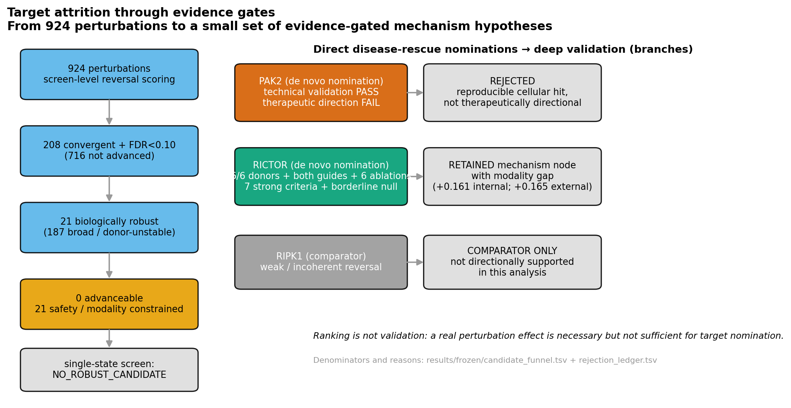
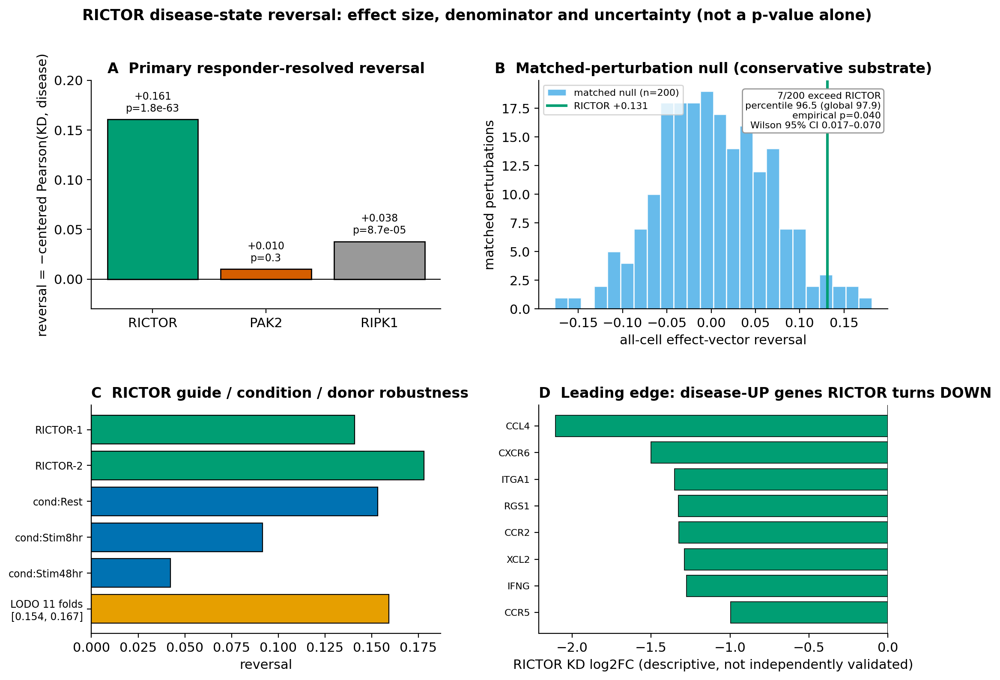
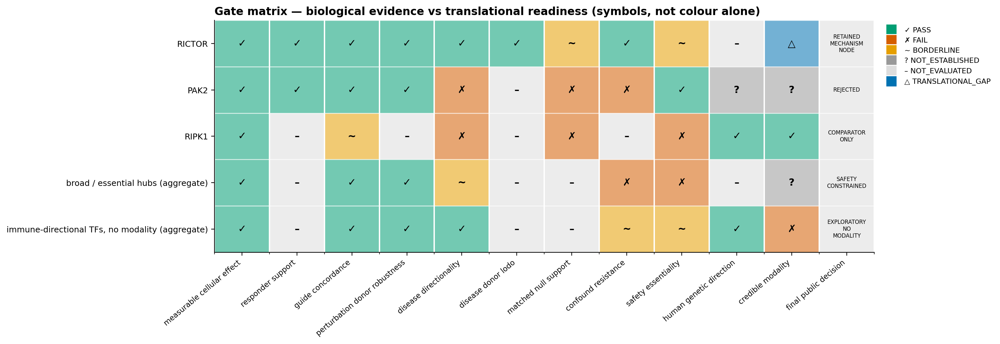
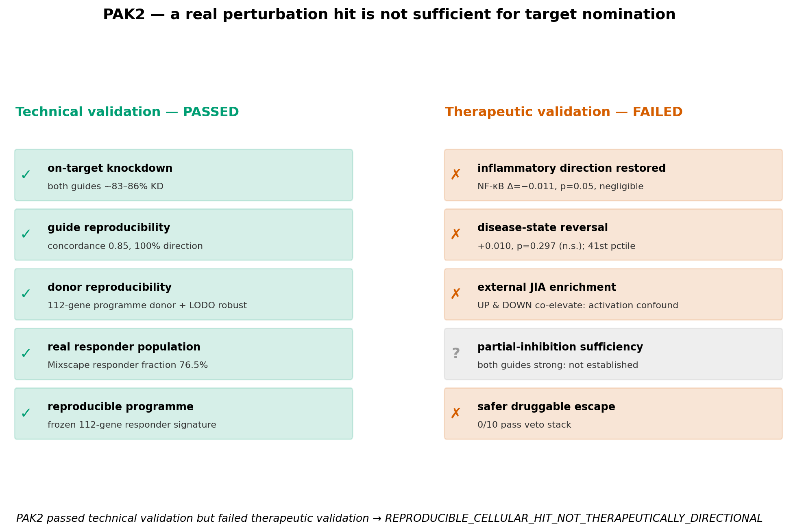

# PerturbGate

**Evidence-Gated Pipeline for T-cell Perturb-seq Mechanism Hypotheses**

A reproducible analysis of a genome-scale primary human CD4 T-cell Perturb-seq
screen, designed to distinguish real perturbation effects from defensible
mechanism hypotheses.

Our first lead, PAK2, was technically reproducible but failed therapeutic
directionality and was rejected.

RICTOR survived a stricter validation workflow as a modest disease-reversing
mechanism hypothesis, but not yet as a validated drug target.

[](https://github.com/MargoSolo/perturbgate-perturbseq/actions/workflows/ci.yml)


-brightgreen)


> **Platforms.** CI is green on `ubuntu-latest` (Python 3.10/3.11/3.12) and
> `macos-latest` (Apple Silicon, Python 3.11) — macOS is **verified on macOS CI**,
> not claimed by inspection alone (install, tests, demo, reproduce, verify, audit
> and a byte-stability check all pass). See
> [docs/MACOS_QUICKSTART.md](docs/MACOS_QUICKSTART.md).

---

## Judge quickstart

*Built with Claude: Life Sciences — Research track. Everything below runs on a
laptop with no private data.*

1. **Watch the 3-minute demo** — shot list + voiceover in
   [docs/DEMO_SCRIPT.md](docs/DEMO_SCRIPT.md) *(video to be recorded from this
   script; see [Video assets](#video-assets)).*
2. **Open PerturbGate Explorer** — [reports/perturbgate_explorer.html](reports/perturbgate_explorer.html)
   (self-contained; search all 924 perturbations by gene and read why each was or
   was not advanced).
3. **Review the main result table** — [the finding table below](#2-main-finding)
   / [`results/frozen/primary_comparison.tsv`](results/frozen/primary_comparison.tsv).
4. **Run `make demo`** — recomputes RICTOR's **+0.161** disease reversal from
   compact committed inputs in under two minutes and validates the golden values.
5. **Inspect the complete decision trail** —
   [docs/DECISION_TRAIL.md](docs/DECISION_TRAIL.md) and the
   [rejection ledger](results/frozen/rejection_ledger.tsv).

---

## 1. Biological question

**Which perturbation hits in a genome-scale primary human CD4 T-cell Perturb-seq
screen remain credible after responder, guide, donor, disease-direction,
null-calibration, confound, safety and modality checks?**

Perturb-seq can identify thousands of real cellular effects. The open question for
target discovery is not *which knockdown changes the cell most*, but *which
effect survives the additional evidence required to nominate a mechanism or a
target*. We analysed **924 gene-target perturbations** (the perturbations with a
usable genome-scale effect vector; every row is a unique gene knockdown — see the
[denominator audit](results/frozen/denominator_audit.tsv)) against a donor-paired
disease-state direction built from an independent juvenile idiopathic arthritis
(JIA) synovial single-cell atlas.

## 2. Main finding

| Target | Public label | Reversal | Robustness | Decision |
|---|---|---|---|---|
| **RICTOR** | `DISEASE_REVERSING_MECHANISM_NODE_WITH_MODALITY_GAP` | **+0.161** (p=1.8e-63) | both guides +; **11/11** disease-donor LODO +; all 3 conditions +; matched percentile 96.5 | **Retained** mechanism hypothesis — *not* a validated target |
| **PAK2** | `REPRODUCIBLE_CELLULAR_HIT_NOT_THERAPEUTICALLY_DIRECTIONAL` | +0.010 (p=0.297, n.s.) | technically real & reproducible, but external JIA enrichment activation-confounded | **Rejected** |
| **RIPK1** | `COMPARATOR_NOT_DIRECTIONALLY_SUPPORTED_IN_THIS_ANALYSIS` | +0.038 (incoherent) | comparator only | Not supported by this test |

- **PAK2** was a real cellular hit but failed therapeutic validation.
- **RICTOR** was retained as `DISEASE_REVERSING_MECHANISM_NODE_WITH_MODALITY_GAP`.
- **RIPK1** was not directionally supported in this analysis.

RICTOR's matched-null evidence is **nominal but statistically marginal**: only 200
matched controls exist, 7 of which exceed RICTOR (empirical p ≈ 0.040; finite-pool
95% CI extends to ≈ 0.07). We therefore report *seven strong convergence checks
plus a borderline matched null* — never "8/8 decisive criteria".

## 3. Evidence and the negative result

**Target attrition through evidence gates** — ranking is not validation.
Candidates are retained, downgraded, not advanced, or rejected with an explicit
reason (full trail: [rejection ledger](results/frozen/rejection_ledger.tsv),
[candidate funnel](results/frozen/candidate_funnel.tsv),
[DECISION_TRAIL.md](docs/DECISION_TRAIL.md)).



**RICTOR directionality and matched-null calibration** — we report effect size,
denominator and uncertainty, not a p-value alone. Two RICTOR numbers, never mixed
silently: **+0.161** primary responder-resolved reversal, and **+0.131**
conservative all-cell projection used only to calibrate the matched null.



**Gate matrix** — biological evidence separated from translational readiness. A
row can pass every biological gate yet carry a `TRANSLATIONAL_GAP` in modality
(RICTOR), or pass technical gates and fail directionality (PAK2).



**PAK2 rejection case study — the negative result that matters.** PAK2 had strong
on-target knockdown, guide and donor reproducibility, a real responder population,
and a reproducible programme — then failed to restore the disease state, its
external JIA enrichment proved activation-confounded, partial inhibition was not
established, and no safer druggable escape target reproduced the programme.



> **PAK2 passed technical validation but failed therapeutic validation.
> PerturbGate preserves that distinction: it treats a real perturbation effect as
> necessary but not sufficient for target nomination.**

Supplementary figures (linked, not embedded):
[RICTOR robustness](figures/supplementary_rictor_robustness.png) ·
[gate ablation](figures/supplementary_gate_ablation.png). Every figure has source
data under [figures/source_data/](figures/source_data/); legends in
[docs/FIGURE_LEGENDS.md](docs/FIGURE_LEGENDS.md).

## 4. Why it matters

A real perturbation effect can still send a laboratory toward the wrong target.
PerturbGate helps prioritize which experimental validation is worth performing
next: it distinguishes technical perturbation validity, biological
reproducibility, disease directionality, and translational readiness — four
things that a single ranking usually collapses into one.

> **PerturbGate did not succeed because it found a positive hit. It succeeded
> because every retained claim survived an explicit record of how competing
> claims failed.**

Negative results, detected confounds, and superseded interpretations are
first-class, auditable outputs
([SUPERSEDED_RESULTS.md](docs/SUPERSEDED_RESULTS.md),
[FAILURE_MODES.md](docs/FAILURE_MODES.md)).

## 5. Reproducibility

```bash
git clone https://github.com/MargoSolo/perturbgate-perturbseq.git
cd perturbgate-perturbseq

make setup     # install the package (+ dev tools)
make demo      # Level 1: recompute the headline reversal from compact inputs (< 2 min)
make verify    # schemas + golden values + claims + funnel + superseded guard + audit
make reproduce # Level 2: recompute robustness from public derived matrices (< 5 min)
make full      # Level 3: reconstruct from open raw data (server-scale)
```

**No `make`?** Every target has a plain-Python equivalent (macOS/Windows/Linux):

| Make target | Plain command |
|---|---|
| `make setup` | `python -m pip install -e ".[dev]"` |
| `make demo` | `python -m perturbgate.cli demo` |
| `make reproduce` | `python -m perturbgate.cli reproduce` |
| `make figures` | `python -m perturbgate.cli figures` |
| `make verify` | `python -m perturbgate.cli verify` |
| `make manifest` | `python -m perturbgate.cli manifest` |
| `make test` | `python -m pytest` |
| `make lint` | `python -m ruff check src scripts tests` |
| `make privacy-audit` | `python scripts/public_readiness_audit.py` |
| `make full` | `python scripts/run_full_pipeline.py` (server-scale) |

macOS users: see [docs/MACOS_QUICKSTART.md](docs/MACOS_QUICKSTART.md) (incl. Apple
Silicon notes and how to serve the Explorer with `python -m http.server`).

| Level | Command | Needs | Time | What it proves |
|---|---|---|---|---|
| **1 Demo** | `make demo` | laptop, committed compact inputs | < 2 min | recomputes RICTOR **+0.161** (and PAK2/RIPK1) from per-gene vectors; regenerates tables + figures; validates golden values |
| **2 Analytical** | `make reproduce` | committed pseudobulk matrices | < 5 min | recomputes guide + disease-donor LODO robustness; compares to frozen |
| **3 Full open-data** | `make full` | open raw data, high-memory server | hours | rebuilds the disease vector + genome-scale effect vectors and reruns everything |

Level 1 is **artifact reproducibility**, not end-to-end raw-data reproduction —
see [REPRODUCIBILITY_LEVELS.md](docs/REPRODUCIBILITY_LEVELS.md). Both datasets are
open; only derived per-gene aggregate vectors are redistributed here, with
attribution ([Open-data statement](docs/OPEN_DATA_STATEMENT.md) ·
[Data availability](docs/DATA_AVAILABILITY.md) ·
[Data licenses](docs/DATA_LICENSES.md) ·
[manifest](data/public_data_manifest.tsv)).

## 6. Software details

- reusable Python package + CLI (`perturbgate`): disease-reversal scoring,
  matched-perturbation null calibration with finite-pool uncertainty, guide /
  donor / condition / LODO robustness, the pre-specified 8-criterion decision
  gate, candidate attrition, a claim ledger, and code-generated figures;
- frozen public artifacts ([results/frozen/](results/frozen/)) — 924-perturbation
  authoritative reversal table, candidate funnel, rejection ledger, gate matrix,
  gate ablation, matched-null values, claim registry, superseded-claim registry,
  analysis contract, denominator audit, results manifest;
- 53 tests, continuous integration, and an automated privacy / public-readiness
  audit; three reproducibility levels; four main figures + two supplementary.

## Scope and intended use

PerturbGate is not a conventional Perturb-seq hit caller. It asks a stricter
question: which perturbation effects survive the additional evidence required
for mechanism or target nomination?

PerturbGate is designed to:
- distinguish technical perturbation validity from therapeutic directionality;
- expose why candidates were retained, downgraded or rejected;
- produce auditable mechanism hypotheses rather than an opaque score;
- prioritize the next experiments worth performing.

PerturbGate is **not**:
- a clinical or diagnostic tool;
- a medical device;
- a treatment-recommendation system;
- a substitute for experimental validation;
- evidence that RICTOR is already a validated drug target.

> **PerturbGate does not replace wet-lab validation. It helps decide which
> wet-lab experiment is worth running next.**

## What we do **not** claim

> - that RICTOR is a **validated drug target**;
> - that systemic RICTOR inhibition is **safe**;
> - that a **selective RICTOR modality** currently exists;
> - that synovium-vs-blood is equivalent to disease-vs-healthy tissue;
> - that the adjusted-vector sensitivity analysis is **independent biological replication**;
> - that PAK2 is an **anti-inflammatory target**;
> - that **all 924 perturbations** underwent deep candidate validation;
> - that the **nominal matched-null significance** is definitive.

## How Claude was used

**Claude mattered most when the original hypothesis failed.**

Claude Code and Claude Science were used not simply to write code, but to:
- design falsification tests that rejected PAK2;
- detect activation-confounded disease enrichment;
- replace an inflated RICTOR estimate with the corrected **+0.161** result;
- distinguish repeated Monte Carlo draws from 200 independent matched controls;
- preserve negative and superseded results instead of rationalizing them.

All public claims resolve to data artifacts, primary literature or official
databases, not to AI output. Full detail: [CLAUDE_USAGE.md](docs/CLAUDE_USAGE.md).

## Limitations

The matched-null margin is thin (finite pool of 200); synovium-vs-blood is a
disease *surrogate*, not disease-vs-healthy tissue; the adjusted-vector analysis
is same-cohort sensitivity, not independent replication; RICTOR's modality,
safety and human-genetic direction are unresolved. Full list in
[LIMITATIONS.md](docs/LIMITATIONS.md).

## Ongoing study and manuscript plan

This repository is the **frozen hackathon release** of an ongoing study. Planned
extensions — independent same-tissue disease validation, partial-inhibition /
titration analyses, deeper translational safety and modality assessment, and,
where feasible, experimental validation — are intended to form a full scientific
manuscript. Future analyses will be versioned separately and will **not** silently
alter the frozen hackathon conclusions
([MANUSCRIPT_ROADMAP.md](docs/MANUSCRIPT_ROADMAP.md)).

## Video assets

No recorded video is committed yet. The 3-minute demo is fully scripted
(timestamps, voiceover, shot list, commands, and a fallback) in
[docs/DEMO_SCRIPT.md](docs/DEMO_SCRIPT.md); record against that script and place
the file under `reports/` (e.g. `reports/perturbgate_demo.mp4`) before submission.

## Citation and acknowledgements

Please cite this repository ([CITATION.cff](CITATION.cff)) and the two upstream
datasets ([NOTICE](NOTICE)). We thank the **Marson and Pritchard laboratories**
and the CZI Virtual Cells Platform for the Perturb-seq data; the **Knight et al.**
and **Bolton/Mahony et al.** teams and CZ CELLxGENE for the JIA synovial atlas;
the maintainers of NumPy, pandas, SciPy, Matplotlib and PyArrow; and the
organizers of *Built with Claude: Life Sciences* (Anthropic × Gladstone
Institutes).

---

*Documentation index:* [Hackathon summary](docs/HACKATHON_SUBMISSION.md) ·
[Methods](docs/METHODS.md) · [Results](docs/RESULTS.md) ·
[Decision trail](docs/DECISION_TRAIL.md) · [Failure modes](docs/FAILURE_MODES.md) ·
[Claims & evidence](docs/CLAIMS_AND_EVIDENCE.md) ·
[Superseded results](docs/SUPERSEDED_RESULTS.md) ·
[Analysis contract](docs/ANALYSIS_CONTRACT.md) · [Technical note](docs/TECHNICAL_NOTE.md) ·
[Reproducibility](docs/REPRODUCIBILITY.md) · [Translational context](docs/TRANSLATIONAL_CONTEXT.md) ·
[Claude usage](docs/CLAUDE_USAGE.md) · [Explorer](reports/perturbgate_explorer.html)
