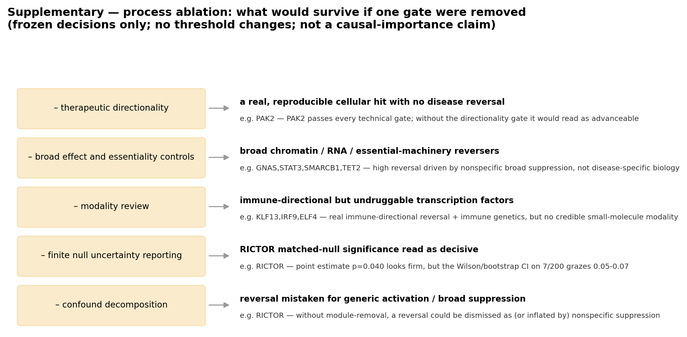
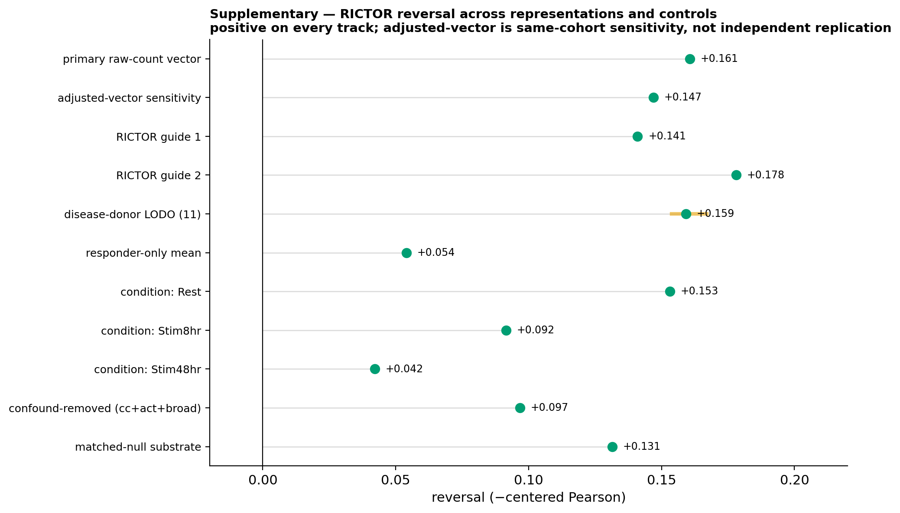

# Results

TargetGate is an evidence-gated pipeline for generating and stress-testing target-nomination
hypotheses from a human CD4+ T-cell Perturb-seq dataset. The central result is not a single
positive hit but a set of retained, rejected, and superseded claims, each accompanied by an
explicit record of how competing interpretations failed. A real perturbation effect is treated
as **necessary but not sufficient** for target nomination: a claim is retained only when it
survives directional, robustness, calibration, confound, safety, and modality gates
simultaneously.

Three perturbations were carried into deep, candidate-specific evaluation on the same corrected
disease vector:

- **RICTOR** was retained as a bounded mechanism hypothesis
  (`DISEASE_REVERSING_MECHANISM_NODE_WITH_MODALITY_GAP`).
- **PAK2** was a technically reproducible cellular hit that failed therapeutic validation and was
  rejected (`REPRODUCIBLE_CELLULAR_HIT_NOT_THERAPEUTICALLY_DIRECTIONAL`).
- **RIPK1** was used only as a benchmark comparator and was not directionally supported by this
  test (`COMPARATOR_NOT_DIRECTIONALLY_SUPPORTED_IN_THIS_ANALYSIS`).

All effect sizes below are disease-reversal scores, defined as the negative centered-Pearson
correlation between the knockdown log2 fold-change vector and the disease log2 fold-change vector
(a positive value means the knockdown opposes the disease direction). The disease vector is a
JIA synovium (tissue and fluid) versus blood, activated-memory CD4 contrast built from raw-count,
donor-paired pseudobulk across 11 paired donors (md5 `2b18d92684db1f70b637e1f098374c7e`). See
[Methods](METHODS.md) for construction details and [Data availability](DATA_AVAILABILITY.md) for provenance.

---

## 1. Primary comparison

The three candidates separate cleanly on directionality and null calibration, not on whether a
measurable perturbation effect exists (all three produce reproducible transcriptional effects).
Figure 2 shows the directionality-versus-null landscape; the underlying values are in
[`results/frozen/primary_comparison.tsv`](../results/frozen/primary_comparison.tsv).

**Figure 2. Disease-reversal directionality and matched-perturbation null calibration for the
three deep candidates.** RICTOR is the only candidate whose reversal both is directionally
coherent and sits above its matched-perturbation null.

| Target | Public label | Primary reversal (centered-Pearson) | Pearson p | Spearman reversal | Guide-1 / Guide-2 reversal | Disease-donor LODO | All 3 conditions positive | Matched-null percentile | Matched-null empirical p | Decision |
|---|---|---|---|---|---|---|---|---|---|---|
| **RICTOR** | `DISEASE_REVERSING_MECHANISM_NODE_WITH_MODALITY_GAP` | **+0.161** (r² ≈ 2.6%) | 1.8e-63 | +0.100 | +0.141 / +0.178 (both +) | 11/11 folds + | Yes (+0.153 / +0.092 / +0.042) | 96.5 (global 97.9) | 0.0398 | Retained as mechanism hypothesis |
| **PAK2** | `REPRODUCIBLE_CELLULAR_HIT_NOT_THERAPEUTICALLY_DIRECTIONAL` | +0.010 (n.s.) | 0.297 | +0.006 | −0.030 / +0.089 | not evaluated | No (−0.028 / −0.002 / +0.064) | 41.3 | 0.672 | Rejected (not therapeutically directional) |
| **RIPK1** | `COMPARATOR_NOT_DIRECTIONALLY_SUPPORTED_IN_THIS_ANALYSIS` | +0.038 (weak/incoherent) | 8.7e-05 | +0.053 | +0.012 / +0.076 | not evaluated | Stim48hr only | 42.2 | 0.672 | Comparator only |

All reversal scores are computed on the primary responder-resolved substrate over 10,832 aligned
genes (see Section 3.6 for the distinction from the conservative all-cell null substrate). RIPK1's
Pearson coefficient is nominally non-zero but its two GSEA enrichment statistics are both negative
(directionally incoherent) and it sits at the 42nd percentile of its matched null, i.e. within the
null distribution rather than above it.

---

## 2. Screen and candidate attrition

Attrition is a **branching decision map, not a linear funnel**. Not all 924 perturbations
underwent every deep test; denominators trace to
[`results/frozen/candidate_funnel.tsv`](../results/frozen/candidate_funnel.tsv),
[`results/frozen/rejection_ledger.tsv`](../results/frozen/rejection_ledger.tsv), and
[`results/frozen/all_perturbations_authoritative_reversal.tsv`](../results/frozen/all_perturbations_authoritative_reversal.tsv).
Figure 1 depicts the branching structure.

**Figure 1. Branching attrition from screen-wide scoring to candidate-specific decisions.**

| Stage | Scope | Entering | Advanced | Not advanced / constrained | Principal reason |
|---|---|---|---|---|---|
| S0 — screen-level reversal scoring | screen-wide | 924 | 208 | 716 | no measurable effect / not advanced |
| S1 — biological robustness (donor-consistent subvector, bootstrap, jackknife) | screen-wide | 208 (convergent + FDR<0.10) | 21 | 187 | broad transcriptional effect / donor-unstable |
| S2 — safety / essentiality / tractability / modality | screen-wide | 21 | 0 | 21 | essentiality or safety liability; no credible modality |
| D0 — PAK2 deep candidate validation | candidate-specific | 1 | 0 | 1 (rejected) | not therapeutically directional |
| R0 — RICTOR bounded pre-specified rescue | candidate-specific | 1 | 1 | 0 | retained mechanism hypothesis |
| C0 — RIPK1 comparator | candidate-specific | 1 | 0 | 1 | comparator only |

The single-state screen yielded **no advanceable candidate** (`NO_ROBUST_CANDIDATE`): all 21
biologically robust shortlist entries were safety- or modality-constrained. Representative
constraints, from the rejection ledger:

- **Broad / essential hubs** (GNAS, STAT3, SMARCB1, TET2): high reversal driven by nonspecific
  broad suppression, flagged `SAFETY_CONSTRAINED` (e.g. FOXP3-deep-collapse, pan-essential
  machinery, tumour-suppressor liabilities).
- **Immune-directional but undruggable transcription factors** (KLF13, IRF9, ELF4): real
  immune-directional reversal but `NO_CREDIBLE_MODALITY`.

RICTOR was recovered not from this single-state screen but from a separate, bounded,
pre-specified rescue on the corrected raw-count disease vector (stage R0).

---

## 3. RICTOR: eight pre-specified criteria (seven strong, one borderline)

Eight criteria were fixed **before** the raw-count reversal result was viewed:

1. centered-Pearson reversal > 0
2. Spearman reversal > 0
3. ranked-GSEA reversal in the same direction
4. both RICTOR guides positive
5. all 11 disease-donor leave-one-out folds positive
6. responder-only support
7. positive in all three conditions
8. above the matched-perturbation null at the frozen point estimate

RICTOR satisfied **seven strong convergence checks (criteria 1–7)** and **nominally exceeded a
matched-perturbation null (criterion 8), with borderline finite-pool uncertainty**. Criterion 8
is the weakest and most marginal of the set; this is stated explicitly rather than rounded up to a
decisive score.

### 3.1 Directionality (criteria 1–3)

The primary responder-resolved reversal is **+0.161** centered-Pearson
(p = 1.8e-63; r² ≈ 2.6%; 10,832 aligned genes), with a concordant Spearman reversal of **+0.100**
and a ranked-GSEA reversal in the same direction (GSEA reversal statistic 1.84). The modest r²
reflects that a single perturbation explains a small but highly consistent fraction of a
genome-wide disease contrast.

### 3.2 Guide robustness (criterion 4)

Both guides are positive and directionally concordant, arguing against an off-target artifact of
a single guide (see [`results/frozen/rictor_guides.tsv`](../results/frozen/rictor_guides.tsv)):

| Guide | Aligned genes | Reversal (Pearson) | Pearson p | Reversal (Spearman) |
|---|---|---|---|---|
| RICTOR-1 | 10,832 | +0.141 | 3.4e-49 | +0.061 |
| RICTOR-2 | 10,832 | +0.178 | 7.1e-78 | +0.123 |

### 3.3 Disease-donor leave-one-out (criterion 5)

All **11 of 11** disease-donor leave-one-out folds are positive, with the point estimate confined
to a narrow band of **+0.154 to +0.167** (full-cohort value +0.161). No single disease donor
drives the result ([`results/frozen/rictor_lodo.tsv`](../results/frozen/rictor_lodo.tsv)).

### 3.4 Condition coverage (criterion 7)

The reversal is positive in all three Perturb-seq conditions, strongest at rest and attenuating
with stimulation duration ([`results/frozen/rictor_conditions.tsv`](../results/frozen/rictor_conditions.tsv)):

| Condition | Reversal (Pearson) | Pearson p | Aligned genes |
|---|---|---|---|
| Rest | +0.153 | 6.7e-58 | 10,832 |
| Stim8hr | +0.092 | 1.3e-21 | 10,832 |
| Stim48hr | +0.042 | 1.1e-05 | 10,832 |

### 3.5 Responder-only support (criterion 6)

Restricting to responder cells preserves the direction: **93% of responder strata are positive and
all disease donors are positive**. The effect is not an artifact of pooling non-responding cells.

### 3.6 Matched-null calibration and its uncertainty (criterion 8, the borderline gate)

Calibration against a matched-perturbation null is deliberately performed in a single, shared
feature space, which requires a **conservative all-cell substrate** distinct from the primary
responder-resolved substrate. The two substrates must never be silently mixed:

- **Primary responder-resolved substrate** (donor random-effects meta knockdown vector): reversal
  **+0.161** over 10,832 genes. Used for the directional and robustness criteria (Sections 3.1–3.5).
- **Conservative all-cell null substrate** (all-cell effect-vector projection): reversal **+0.131**
  over a 7,393-gene intersection. Used **only** to calibrate against the matched null in the same
  space.

The +0.030 gap between substrates decomposes into **−0.036 from the narrower gene universe** and
**+0.066 from the responder-to-all-cell representation change**; the all-cell number (+0.131) is the
more conservative of the two.

On this conservative substrate, RICTOR's reversal falls at the **96.5th percentile** of its
matched null (global percentile 97.9; z = 2.02). Of **200 matched control perturbations
(k = 200 nearest neighbours), 7 exceed RICTOR**, giving an empirical p of **0.0398**. Because this
rests on a finite pool of 200 controls, the uncertainty is reported explicitly:

- Wilson 95% CI on the empirical p: **(0.017, 0.070)**
- Monte-Carlo bootstrap 95% CI: **(0.015, 0.065)**
- Seed-stable p range: **[0.032, 0.042]**; pooled p **0.034**

The point estimate looks firm, but the confidence interval grazes the 0.05–0.07 region. Nominal
matched-null significance is therefore **not** treated as definitive; this is the single borderline
gate underlying the "modality gap" framing rather than a "validated target" framing. Values are in
[`results/frozen/matched_null.tsv`](../results/frozen/matched_null.tsv) and
[`results/frozen/rictor_matched_null_values.tsv`](../results/frozen/rictor_matched_null_values.tsv).

### 3.7 Confound resistance

Removing curated confound modules (cell-cycle, activation, stress, apoptosis, T-identity) leaves
the reversal essentially unchanged (deltas ≤ |0.0012|), arguing that the signal is not generic
activation or nonspecific suppression. Removing the 780 strongly knockdown-down genes drops the
reversal to **+0.093**, but those 780 genes **include the pathogenic disease-UP genes CXCR6, CCL4,
and IFNG** — so their removal deletes real disease-relevant signal, not a confound. See
[`results/frozen/confound_decomposition.tsv`](../results/frozen/confound_decomposition.tsv) and the
supplementary ablation figure.

| Module removed | Genes removed | Reversal | Delta vs base |
|---|---|---|---|
| none (base) | 0 | +0.161 | — |
| cell-cycle | 23 | +0.162 | +0.0011 |
| activation | 23 | +0.162 | +0.0012 |
| stress | 12 | +0.160 | −0.0001 |
| apoptosis | 12 | +0.161 | +0.0004 |
| T-cell identity | 19 | +0.160 | −0.0004 |
| broad down-regulation | 780 | +0.093 | −0.0677 |
| cell-cycle + activation + broad-down | 817 | +0.097 | −0.0639 |

### 3.8 Leading edge

The reversal is carried by directionally coherent suppression of pathogenic disease-UP genes, with
**no reinforced disease-UP leading-edge genes**. RICTOR knockdown turns **down** disease-UP genes
including CXCL13 (disease +4.15, knockdown −0.20), CXCR6 (+3.36, −1.50), CCL4 (+3.08, −2.11),
IFNG (+2.69, −1.27), RGS1 (+2.72, −1.33), GZMB (+3.12, −0.53), and PDCD1 (+2.43, −0.54). The
disease-DOWN arm is directionally restored in the same run (e.g. FOXP3 disease −0.98, knockdown
+0.85; TCF7 disease −0.82, knockdown +0.70), consistent with preserved regulatory-T and naive
T-cell identity. See [`results/frozen/leading_edge.tsv`](../results/frozen/leading_edge.tsv).

### 3.9 Safety and modality

Safety screening flags a **mild, donor-inconsistent early-toxicity signal** (apoptosis mean delta
+0.030, worst stratum +0.075, consistent in only ≤ 33% of strata) alongside **preserved T-cell and
regulatory-T identity** (T-identity mean delta +0.001, Treg-identity delta −0.002), and knockdown
reduces the activation module (mean delta −0.036), consistent with the disease-reversal direction
([`results/frozen/safety_summary.tsv`](../results/frozen/safety_summary.tsv)).

The decisive translational limitation is **modality**: RICTOR is a core mTORC2 scaffold with **no
selective small-molecule modality** currently available. This is the "modality gap" in the retained
label. RICTOR robustness across guides, folds, conditions, and confound ablation is summarized in
the supplementary robustness figure.

> **Superseded.** An earlier RICTOR reversal of ~+0.43 (SUP-01) came from an old
> covariate-adjusted / residency-removed 77-gene subset and was inflated by a frozen-subset gene
> universe and a responder-only knockdown representation. It is **superseded** by the +0.161
> primary and +0.131 null-substrate values reported here and must not be presented as a current
> result. See [Superseded results](SUPERSEDED_RESULTS.md).

---

## 4. PAK2: reproducible cellular hit, rejected as a nomination

PAK2 passed technical validation but failed therapeutic validation. Figure 4 contrasts the two.

**Figure 4. PAK2 passes technical gates but fails the therapeutic-directionality and matched-null
gates.**

**Passed technical validation.** On-target knockdown ~83–86% for both guides; guide concordance
0.85 (100% direction agreement); a 112-gene frozen responder programme robust at gene level across
donors, guides, and leave-one-out; Mixscape responder fraction 76.5%; non-toxic
(`specific_non_toxic`).

**Failed therapeutic validation.**

- Disease reversal **+0.010, p = 0.297** (not significant); matched-null **41st percentile**
  (empirical p 0.672 — within the null).
- Responder NF-κB delta **−0.011, p = 0.05** — negligible effect, with no donor-direction
  consistency.
- External JIA enrichment is **activation-confounded**: the frozen UP and DOWN modules co-elevate
  (diverge = False), so `disease_relevant = False`.
- Partial-inhibition sufficiency **not established**: both guides produce similarly strong
  knockdown, so there is no strong-versus-weak titration axis.
- No safer druggable immune-directional escape target (0/10 pass the veto stack).

PAK2 is therefore a **real, reproducible CD4 T-cell perturbation hit that is not therapeutically
directional**, and is rejected as a target nomination. Four earlier PAK2 support claims are
explicitly superseded — the JIA joint-enrichment "disease support" (SUP-02), partial-inhibition
support (SUP-03), a safer neighbour reproducing the programme (SUP-04), and a PAK2–WASF2
therapeutic axis (SUP-05); see [Superseded results](SUPERSEDED_RESULTS.md). The PAK2 case is the
clearest demonstration that a measurable, reproducible effect is necessary but not sufficient.

---

## 5. RIPK1: comparator, not directionally supported here

RIPK1 was included as a benchmark comparator because it has real IBD / autoinflammatory human
genetics and clinical-stage kinase inhibitors (full loss-of-function causes immunodeficiency, so
kinase inhibition, not knockdown, is the relevant modality). In this specific disease-reversal
test its signal is **weak and incoherent**: reversal +0.038, both GSEA enrichment statistics
negative, matched-null 42nd percentile (empirical p 0.672). RIPK1 is neither nominated nor rejected
by this analysis; it is retained only to anchor the comparison.

---

## 6. Gate matrix: why each decision follows from the evidence

The gate matrix makes explicit which gate each candidate fails, so that decisions are traceable
rather than holistic. Figure 3 renders the matrix; values are in
[`results/frozen/gate_matrix.tsv`](../results/frozen/gate_matrix.tsv).

**Figure 3. Per-candidate gate outcomes and the resulting public decision.**

| Row | Cellular effect | Responder | Guide concordance | Donor robustness | Disease directionality | Disease LODO | Matched null | Confound resistance | Safety / essentiality | Human genetic direction | Credible modality | Decision |
|---|---|---|---|---|---|---|---|---|---|---|---|---|
| RICTOR | PASS | PASS | PASS | PASS | PASS | PASS | **BORDERLINE** | PASS | BORDERLINE | not evaluated | **TRANSLATIONAL_GAP** | Retained mechanism node |
| PAK2 | PASS | PASS | PASS | PASS | **FAIL** | — | **FAIL** | **FAIL** | PASS | not established | not established | Rejected |
| RIPK1 | PASS | — | BORDERLINE | — | **FAIL** | — | **FAIL** | — | **FAIL** | PASS | PASS | Comparator only |
| Broad / essential hubs (aggregate) | PASS | — | PASS | PASS | BORDERLINE | — | — | **FAIL** | **FAIL** | — | not established | Safety-constrained |
| Immune-directional TFs, no modality (aggregate) | PASS | — | PASS | PASS | PASS | — | — | BORDERLINE | BORDERLINE | PASS | **FAIL** | Exploratory, no modality |

A companion gate-ablation analysis (supplementary figure and
[`results/frozen/gate_ablation.tsv`](../results/frozen/gate_ablation.tsv)) shows what would falsely
survive if any single gate were removed: without the therapeutic-directionality gate, PAK2 would
read as advanceable; without broad-effect and essentiality controls, GNAS/STAT3/SMARCB1/TET2 would
survive on nonspecific suppression; without modality review, KLF13/IRF9/ELF4 would survive despite
having no credible small-molecule modality; and without finite-null uncertainty reporting, RICTOR's
matched-null p = 0.040 would be read as decisive rather than borderline.

---

## 7. What these results do and do not claim

- RICTOR is retained as a **disease-reversing mechanism hypothesis with a modality gap**, not a
  validated drug target. Systemic RICTOR inhibition is **not** shown to be safe, and **no** selective
  RICTOR modality currently exists.
- The disease contrast is **synovium-versus-blood, not disease-versus-healthy tissue**; the
  covariate-adjusted sensitivity analysis is same-cohort and is **not** independent biological
  replication.
- PAK2 is **not** an anti-inflammatory target on this evidence, despite being a real cellular hit.
- **Not all 924 perturbations** underwent deep validation; nominal matched-null significance is
  **not** definitive.
- Claude output is not itself scientific evidence: every biological claim above resolves to a frozen
  data artifact under [`results/frozen/`](../results/frozen/), a primary paper, or an official
  database.

Retained, rejected, and superseded claims, with exact wording, denominators, uncertainty, and
supporting artifacts, are enumerated in
[`results/frozen/claims.json`](../results/frozen/claims.json),
[`results/frozen/rejection_ledger.tsv`](../results/frozen/rejection_ledger.tsv), and
[`results/frozen/superseded_claims.json`](../results/frozen/superseded_claims.json). For methods and
reproducibility, see [Methods](METHODS.md) and [Reproducibility](REPRODUCIBILITY.md); for corrected
interpretations, see [Superseded results](SUPERSEDED_RESULTS.md).
